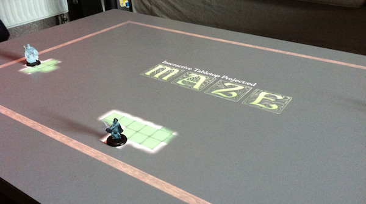
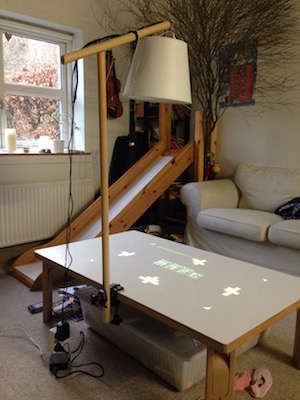
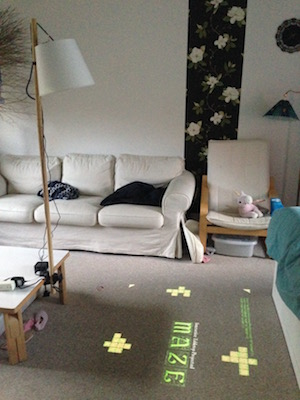

Interactive Tabletop Project:ed
===============================

Interactive Tabletop Project:ed is a framework for creating interactive, digital tabletop projects, focusing mainly on board games played with physical bricks. It provides a JavaScript client API for easy content creation.

A working prototype setup consisting of a portable projector and a Raspberry Pi with attached camera module can be seen from the github page.

The computer vision backend is written in Python/OpenCV and communicates with the webpage through WebSockets. Getting up and running is as simple as starting the backend server:

    $ cd Server/src
    $ python main.py

and referencing the client library in a web page and initializing it as follows (CoffeeScript source):

    @client = new Client()
    @client.connect((() => @onConnected()), ((json) => @onMessage(json)))
    
    onConnected: ->
        @client.reset()
    
    onMessage: (json) ->
        switch json["action"]
            ...

To create a tiled board of size (32, 20) and wait for a brick to be found in any of the top/left corner tiles implement the following few lines:

    onMessage: (json) ->
        switch json["action"]
            when "reset" then @client.initializeBoard()
            when "initializeBoard" then @client.initializeTiledBoardArea(32, 20, 0.0, 0.0, 1.0, 1.0, 0)
            when "initializeTiledBoardArea" then @client.reportBackWhenBrickFoundAtAnyOfPositions(0, ([0, 0], [1, 0], [1, 0]))
            when "brickFoundAtPosition" then alert("Brick found at position: " + json["payload"]["position"])

